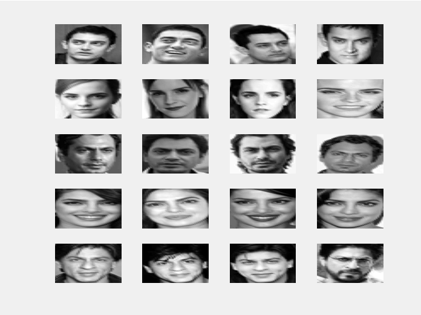
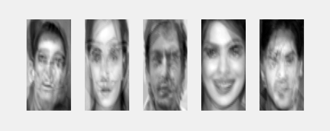
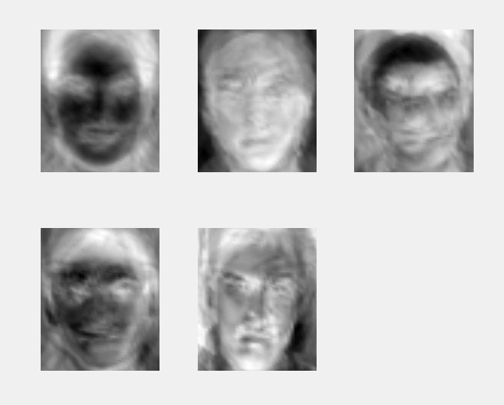
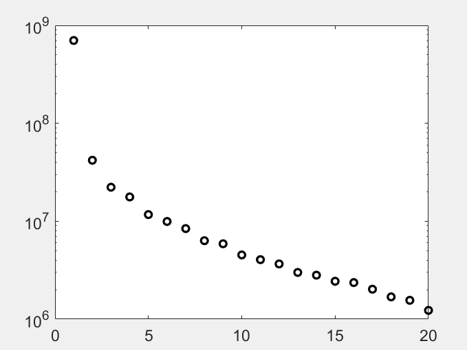
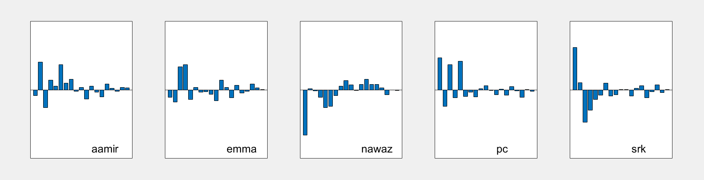
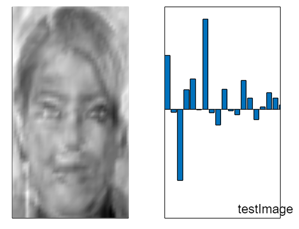
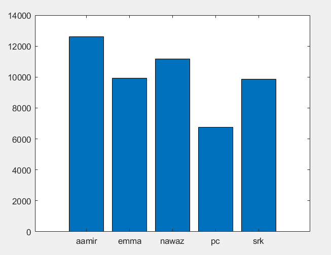

# Face-Recognition-using-Singular-Value-Decomposition
The basic though an intrinsic implementation of Image Processing using the concepts of Principal Component Analysis(PCA)

## Image Database
Image database contains images of 20 celebrities. each individual has 4 images in the database. The image format is 24-bit color jpeg in other words 200 * 180 array of pixels and each pixel is represented by 24 bits of RGB color values. For, simplicity in implementation all the images in the database have been converted to gray-scale images and re-sized to same dimensions. The figure below shows a plot of all the images in the training set.

## Implementation
### Average Faces
The correlation between the images or apparently the facial features of an
individual is done by finding the average faces for every distinct individual
in the training set. The figure below shows the average faces of the different
celebrities in the database.

### Eigen Faces
Eigen Faces or images are nothing but the mathematically produced images
which represents the average faces of all the faces in the universe(here,
database of 20 images). The figure below represents the havve most dominant
average eigen faces for our training set.

The figure below shows a plot of first twenty dominant eigen values of all
the average eigen faces.

### Eigenvalue Projection
The idea of projection tells us how an image is projected onto eigenvectors
which is given as:

                  projection = a * U
where,
a is the reshape vector for an image.
This gives us the projection of a specific image on the Eigenvector space.

This facilitates us with a way of uniquely representing the images of each of
the celebrities. In other words, this step provides different class of images in
a dataset(here individuals) with a unique key to help in the discrimination
task. The figure below shows the bar projections of the different celebrities
onto Eigenvector vector Space.

## Testing
To test if our Face Recognition Software works we take a picture of one of
the celebrities from the database and pass it onto the system. First, the
software projects the new image onto the eigenvector Space. Then, it
re-constructs the image using the eigenvectors. Then, it compares the
re-constructed image with all the images in the database and finds out the
error in the projection of the re-constructed image to that of the original
images.

## Result
To recognise Priyanka Chopra, abbreviated as "pc", an image of her is
passed as a test case through the software and the software successfully
recognises it. The figure below shows the error in the projection of the
re-constructed image to that of the original images of other different
celebrities.

